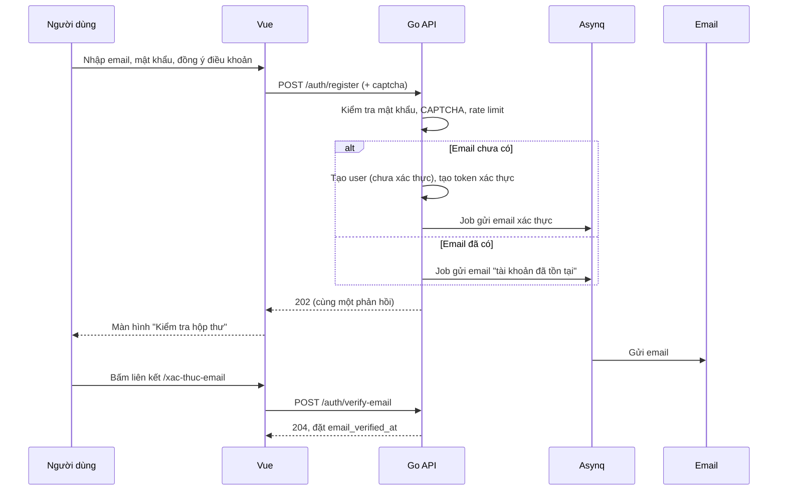
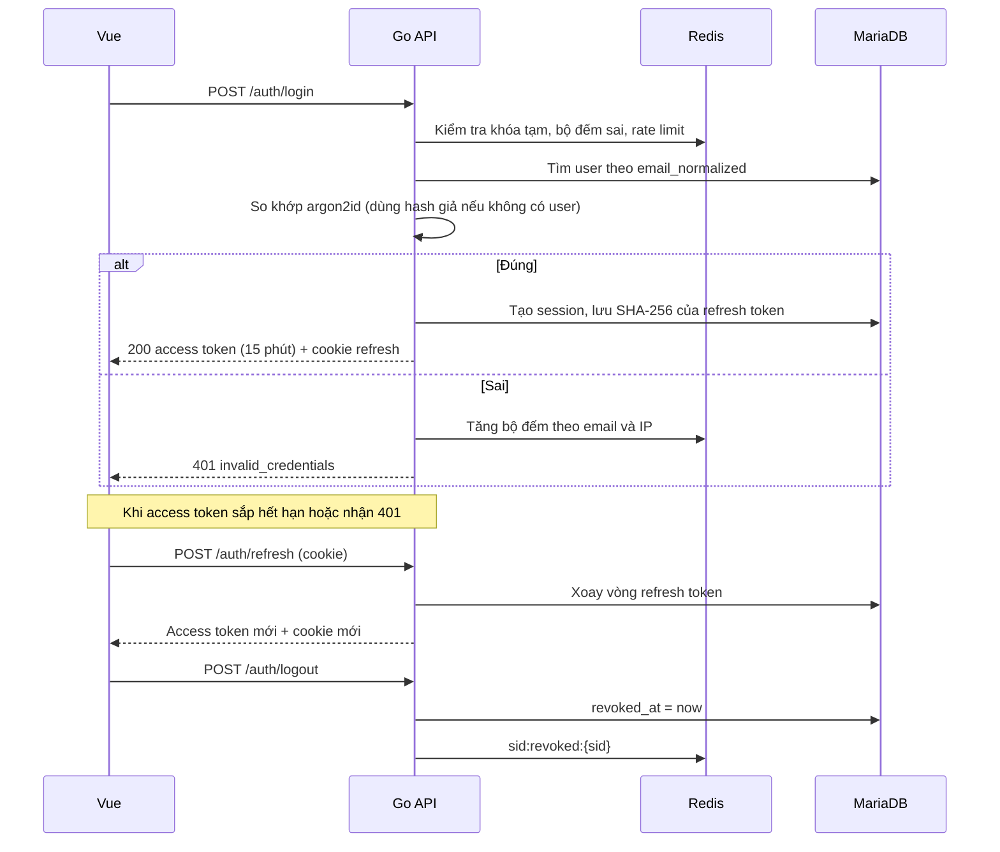

# M1. Tài khoản và xác thực: giải pháp chi tiết (Sora AI Chatbot)

> **Phiên bản:** 1.0, dựa trên `ai-chatbot-tong-quan.md` và `ai-chatbot-nghiep-vu-va-uu-tien-v2.md`
> **Công nghệ nền:** Go (Gin), MariaDB, Redis, Vue 3 + shadcn-vue + Tailwind CSS
> **Màn hình thiết kế:** thư mục `m1-screens/` (14 file SVG, xem mục 10)

---

## Mục lục

1. [Phạm vi và mục tiêu](#1-phạm-vi-và-mục-tiêu)
2. [Các quyết định thiết kế](#2-các-quyết-định-thiết-kế)
3. [Kiến trúc](#3-kiến-trúc)
4. [Mô hình dữ liệu](#4-mô-hình-dữ-liệu)
5. [Thiết kế API](#5-thiết-kế-api)
6. [Luồng nghiệp vụ](#6-luồng-nghiệp-vụ)
7. [Chính sách bảo mật chi tiết](#7-chính-sách-bảo-mật-chi-tiết)
8. [Backend Go](#8-backend-go)
9. [Frontend Vue](#9-frontend-vue)
10. [Danh sách màn hình](#10-danh-sách-màn-hình)
11. [Nội dung thông báo](#11-nội-dung-thông-báo)
12. [Kiểm thử](#12-kiểm-thử)
13. [Kế hoạch triển khai](#13-kế-hoạch-triển-khai)
14. [Điểm cần chốt](#14-điểm-cần-chốt)

---

## 1. Phạm vi và mục tiêu

### 1.1. Trong phạm vi

| Nhóm | Chức năng |
|---|---|
| Đăng ký | Tạo tài khoản bằng email và mật khẩu, đồng ý điều khoản |
| Xác thực email | Gửi liên kết xác thực, gửi lại, xử lý hết hạn |
| Đăng nhập, đăng xuất | JWT + refresh token xoay vòng, đăng xuất một hoặc mọi thiết bị |
| Mật khẩu | Đổi mật khẩu, quên và đặt lại mật khẩu |
| Phiên đăng nhập | Xem danh sách thiết bị, thu hồi từng phiên |
| Chống lạm dụng | Giới hạn thử sai, khóa tạm, CAPTCHA, rate limit |
| Xóa tài khoản | Yêu cầu xóa, thời gian chờ, hủy yêu cầu (phần xóa dữ liệu thực hiện cùng M4/M6) |
| Nhật ký | Audit log cho các sự kiện xác thực |

### 1.2. Ngoài phạm vi (làm sau)

Đăng nhập Google/GitHub, xác thực hai bước (TOTP/passkey), đổi email, đăng nhập không mật khẩu. Thiết kế dưới đây để chừa chỗ cho các mục này (xem mục 2, dòng "Mở rộng").

### 1.3. Mục tiêu chất lượng

- Không lộ việc một email đã có tài khoản hay chưa (chống dò email).
- Token bị đánh cắp có tác hại thấp nhất có thể: access token ngắn hạn, refresh token xoay vòng và phát hiện dùng lại.
- Mọi bí mật (mật khẩu, refresh token, token email) chỉ lưu dưới dạng băm.
- Người dùng luôn thấy và thu hồi được các phiên của mình.

---

## 2. Các quyết định thiết kế

| Chủ đề | Quyết định | Lý do |
|---|---|---|
| Băm mật khẩu | **argon2id** (tham số ở mục 7.1), lưu dạng chuỗi PHC | Chuẩn khuyến nghị hiện nay, kháng GPU tốt hơn bcrypt |
| Access token | **JWT ký EdDSA (Ed25519)**, sống **15 phút**, giữ trong **bộ nhớ trình duyệt** | Không lưu trong localStorage để giảm rủi ro XSS đánh cắp |
| Refresh token | **Chuỗi ngẫu nhiên 256 bit** (không phải JWT), lưu **SHA-256** trong DB, đặt trong **cookie HttpOnly** | Thu hồi được, không đọc được từ JavaScript |
| Vòng đời refresh | Xoay vòng mỗi lần dùng; hết hạn trượt 30 ngày, tối đa tuyệt đối 90 ngày | Cân bằng tiện dụng và an toàn |
| Phát hiện đánh cắp | Dùng lại refresh token cũ → thu hồi cả phiên | Chuẩn "refresh token rotation with reuse detection" |
| Thu hồi tức thời | Redis lưu `sid` đã thu hồi trong 15 phút (bằng TTL access token) | Đăng xuất hoặc khóa có hiệu lực ngay, không phải chờ token hết hạn |
| Chống dò email | Đăng ký, quên mật khẩu luôn trả cùng một phản hồi; thông tin thật gửi qua email | Đăng ký công khai dễ bị quét email |
| Chính sách mật khẩu | Tối thiểu 10, tối đa 128 ký tự, không bắt ký tự đặc biệt, từ chối mật khẩu nằm trong danh sách bị lộ | Theo hướng dẫn NIST SP 800-63B |
| Xác thực email | Liên kết dùng một lần, hết hạn 24 giờ; **bắt buộc trước khi dùng chat và tải tài liệu** | Chi phí LLM do hệ thống chịu, tránh tài khoản rác |
| Brute force | Đếm theo email (kể cả email không tồn tại) và theo IP; CAPTCHA sau 3 lần sai; chờ 15 phút sau 5 lần sai | Không khóa vô hạn để tránh bị lợi dụng khóa tài khoản người khác |
| CAPTCHA | Cloudflare Turnstile (hoặc hCaptcha) | Thân thiện, không cần tương tác ở đa số trường hợp |
| Gửi email | Hàng đợi Asynq, nhà cung cấp SES/Resend/Postmark qua SMTP hoặc API | Không chặn request, có retry |
| Xóa tài khoản | Cần nhập mật khẩu, chờ **7 ngày** rồi xóa thật, đăng nhập lại trong thời gian chờ sẽ hủy | Tránh xóa nhầm, vẫn đáp ứng yêu cầu xóa dữ liệu |
| Mở rộng | Bảng `auth_identities` (thêm sau) cho OAuth/passkey; `users.password_hash` cho phép NULL khi đó | Không phải sửa lại lõi |

> **Về lưu access token trong bộ nhớ:** tải lại trang sẽ mất token, nên frontend gọi `/auth/refresh` khi khởi động để lấy token mới từ cookie. Chi tiết ở mục 9.

---

## 3. Kiến trúc

```
Vue SPA ──HTTPS──► Go/Gin  ──► MariaDB   (users, sessions, auth_tokens, audit_logs)
  │  access token     │
  │  (bộ nhớ)         ├──► Redis     (rate limit, đếm lần sai, sid thu hồi, cooldown email)
  │  refresh cookie   │
  │  (HttpOnly)       └──► Asynq ──► Worker ──► Nhà cung cấp email
  │
  └──► Cloudflare Turnstile (xác minh người thật, backend kiểm tra token)
```

Khuyến nghị đặt SPA và API **cùng site** (ví dụ `app.example.com` và `api.example.com`, hoặc cùng domain qua reverse proxy `/api`) để cookie `SameSite=Strict` hoạt động và không cần CORS rộng.

---

## 4. Mô hình dữ liệu

> ID dùng kiểu `UUID` của MariaDB, sinh UUIDv7 ở phía Go (`google/uuid`). Toàn bộ bảng dùng `utf8mb4`.

### 4.1. `users`

```sql
CREATE TABLE users (
  id                     UUID          NOT NULL PRIMARY KEY,
  email                  VARCHAR(254)  NOT NULL,
  email_normalized       VARCHAR(254)  NOT NULL,
  display_name           VARCHAR(100)  NULL,
  password_hash          VARCHAR(255)  NOT NULL,
  status                 ENUM('active','suspended','pending_deletion') NOT NULL DEFAULT 'active',
  role                   ENUM('user','admin') NOT NULL DEFAULT 'user',
  email_verified_at      DATETIME(3)   NULL,
  password_changed_at    DATETIME(3)   NOT NULL,
  last_login_at          DATETIME(3)   NULL,
  terms_accepted_at      DATETIME(3)   NOT NULL,
  terms_version          VARCHAR(20)   NOT NULL,
  deletion_requested_at  DATETIME(3)   NULL,
  deletion_scheduled_at  DATETIME(3)   NULL,
  created_at             DATETIME(3)   NOT NULL DEFAULT CURRENT_TIMESTAMP(3),
  updated_at             DATETIME(3)   NOT NULL DEFAULT CURRENT_TIMESTAMP(3) ON UPDATE CURRENT_TIMESTAMP(3),
  UNIQUE KEY uq_users_email (email_normalized),
  KEY idx_users_deletion (status, deletion_scheduled_at),
  KEY idx_users_unverified (email_verified_at, created_at)
) ENGINE=InnoDB DEFAULT CHARSET=utf8mb4 COLLATE=utf8mb4_unicode_ci;
```

Chuẩn hóa email: cắt khoảng trắng, chuyển chữ thường, chuẩn hóa Unicode NFKC. **Không** bỏ dấu chấm hay phần `+tag` (sai với nhiều nhà cung cấp).

### 4.2. `sessions`

Mỗi dòng là một thiết bị đăng nhập; refresh token hiện tại nằm trên chính dòng đó.

```sql
CREATE TABLE sessions (
  id                    UUID          NOT NULL PRIMARY KEY,   -- chính là claim "sid" trong JWT
  user_id               UUID          NOT NULL,
  refresh_hash          CHAR(64)      NOT NULL,               -- SHA-256 (hex) của refresh token hiện tại
  prev_refresh_hash     CHAR(64)      NULL,                   -- token ngay trước đó, để phát hiện dùng lại
  rotated_at            DATETIME(3)   NULL,
  device_label          VARCHAR(120)  NULL,                   -- "Chrome trên Windows"
  user_agent            VARCHAR(512)  NULL,
  ip                    VARBINARY(16) NULL,
  ip_country            CHAR(2)       NULL,
  created_at            DATETIME(3)   NOT NULL DEFAULT CURRENT_TIMESTAMP(3),
  last_used_at          DATETIME(3)   NOT NULL DEFAULT CURRENT_TIMESTAMP(3),
  expires_at            DATETIME(3)   NOT NULL,               -- trượt 30 ngày
  absolute_expires_at   DATETIME(3)   NOT NULL,               -- cố định 90 ngày
  revoked_at            DATETIME(3)   NULL,
  revoked_reason        VARCHAR(32)   NULL,                   -- logout | logout_all | password_changed | password_reset | reuse_detected | admin | account_deleted
  UNIQUE KEY uq_sessions_refresh (refresh_hash),
  KEY idx_sessions_prev (prev_refresh_hash),
  KEY idx_sessions_user (user_id, revoked_at),
  CONSTRAINT fk_sessions_user FOREIGN KEY (user_id) REFERENCES users(id) ON DELETE CASCADE
) ENGINE=InnoDB DEFAULT CHARSET=utf8mb4;
```

### 4.3. `auth_tokens` (xác thực email, đặt lại mật khẩu)

```sql
CREATE TABLE auth_tokens (
  id          UUID         NOT NULL PRIMARY KEY,
  user_id     UUID         NOT NULL,
  purpose     ENUM('verify_email','reset_password') NOT NULL,
  token_hash  CHAR(64)     NOT NULL,
  expires_at  DATETIME(3)  NOT NULL,
  used_at     DATETIME(3)  NULL,
  created_ip  VARBINARY(16) NULL,
  created_at  DATETIME(3)  NOT NULL DEFAULT CURRENT_TIMESTAMP(3),
  UNIQUE KEY uq_auth_tokens_hash (token_hash),
  KEY idx_auth_tokens_user (user_id, purpose, used_at),
  CONSTRAINT fk_auth_tokens_user FOREIGN KEY (user_id) REFERENCES users(id) ON DELETE CASCADE
) ENGINE=InnoDB DEFAULT CHARSET=utf8mb4;
```

Khi phát hành token mới cùng `purpose`, đánh dấu `used_at` cho token cũ chưa dùng để mỗi người chỉ có một liên kết còn hiệu lực.

### 4.4. `audit_logs`

```sql
CREATE TABLE audit_logs (
  id          BIGINT UNSIGNED NOT NULL AUTO_INCREMENT PRIMARY KEY,
  user_id     UUID          NULL,
  event       VARCHAR(48)   NOT NULL,
  ip          VARBINARY(16) NULL,
  user_agent  VARCHAR(512)  NULL,
  metadata    JSON          NULL,
  created_at  DATETIME(3)   NOT NULL DEFAULT CURRENT_TIMESTAMP(3),
  KEY idx_audit_user (user_id, created_at),
  KEY idx_audit_event (event, created_at)
) ENGINE=InnoDB DEFAULT CHARSET=utf8mb4;
```

Sự kiện cần ghi: `register`, `email_verified`, `login_success`, `login_failed`, `login_locked`, `logout`, `logout_all`, `refresh_reuse_detected`, `password_changed`, `password_reset_requested`, `password_reset_completed`, `session_revoked`, `deletion_requested`, `deletion_cancelled`, `account_deleted`. Không bao giờ ghi mật khẩu hay token vào `metadata`. Khi xóa tài khoản, `user_id` được đặt NULL, giữ lại bản ghi ẩn danh theo thời hạn lưu trữ đã chọn.

### 4.5. Khóa Redis

| Khóa | Giá trị | TTL | Dùng cho |
|---|---|---|---|
| `login:fail:{email_norm}` | bộ đếm | 15 phút | CAPTCHA sau 3 lần, chờ sau 5 lần |
| `login:lock:{email_norm}` | cờ | 15 phút | Khóa tạm |
| `rl:{route}:{ip}` / `rl:{route}:{key}` | cửa sổ trượt | theo route | Rate limit |
| `sid:revoked:{sid}` | 1 | 15 phút | Thu hồi tức thời access token |
| `mail:cooldown:{purpose}:{user_id}` | 1 | 60 giây | Giãn cách gửi lại email |

---

## 5. Thiết kế API

Tiền tố `/api/v1`. Phản hồi lỗi thống nhất:

```json
{ "error": { "code": "invalid_credentials", "message": "Email hoặc mật khẩu không đúng.", "retry_after": 0 } }
```

### 5.1. Công khai

| Method | Đường dẫn | Body | Thành công | Lỗi chính |
|---|---|---|---|---|
| POST | `/auth/register` | `email`, `password`, `display_name?`, `accept_terms`, `captcha_token` | **202** (luôn, dù email đã tồn tại) | 400 `weak_password`, 400 `captcha_failed`, 429 |
| POST | `/auth/verify-email` | `token` | 204 | 400 `token_invalid_or_expired` |
| POST | `/auth/verify-email/resend` | `email` (hoặc dùng phiên hiện tại) | **202** (luôn) | 429 `cooldown` |
| POST | `/auth/login` | `email`, `password`, `captcha_token?` | 200 `{access_token, expires_in, user}` + cookie refresh | 401 `invalid_credentials`, 400 `captcha_required`, 429 `too_many_attempts` (kèm `retry_after`) |
| POST | `/auth/refresh` | (cookie) | 200 `{access_token, expires_in}` + cookie mới | 401 `session_expired` |
| POST | `/auth/logout` | (cookie) | 204, xóa cookie | |
| POST | `/auth/forgot-password` | `email`, `captcha_token?` | **202** (luôn) | 429 |
| POST | `/auth/reset-password/check` | `token` | 200 `{valid: true}` | 400 `token_invalid_or_expired` |
| POST | `/auth/reset-password` | `token`, `new_password` | 204 | 400 `weak_password`, 400 `token_invalid_or_expired` |

### 5.2. Cần đăng nhập (`Authorization: Bearer <access_token>`)

| Method | Đường dẫn | Mô tả |
|---|---|---|
| GET | `/me` | Hồ sơ: `id`, `email`, `display_name`, `email_verified`, `status` |
| PATCH | `/me` | Cập nhật `display_name` |
| POST | `/me/password` | `current_password`, `new_password`, `sign_out_others` (mặc định `true`) → 204 |
| GET | `/me/sessions` | Danh sách phiên, đánh dấu `current` |
| DELETE | `/me/sessions/{id}` | Thu hồi một phiên |
| DELETE | `/me/sessions` | Thu hồi mọi phiên **trừ** phiên hiện tại |
| POST | `/me/deletion` | `password` → 202, đặt lịch xóa sau 7 ngày |
| DELETE | `/me/deletion` | Hủy yêu cầu xóa |

Các route chat và tài liệu dùng thêm middleware `RequireVerified` (trả 403 `email_not_verified` nếu chưa xác thực).

### 5.3. Cookie refresh

```
Set-Cookie: __Secure-rt=<token>; Path=/api/v1/auth; HttpOnly; Secure; SameSite=Strict; Max-Age=2592000
```

Giới hạn `Path` để cookie chỉ gửi kèm các route `/auth/*`.

---

## 6. Luồng nghiệp vụ

### 6.1. Đăng ký và xác thực email



Quy tắc:

- Mật khẩu được băm trước khi tạo user; thời gian xử lý hai nhánh (có/không có email) phải gần nhau (xem 7.3).
- Tài khoản chưa xác thực **được phép đăng nhập** nhưng bị chặn chat và tải tài liệu; giao diện hiển thị thanh nhắc xác thực kèm nút gửi lại.
- Tài khoản chưa xác thực sau **7 ngày** bị dọn bằng job định kỳ.
- Đặt lại mật khẩu thành công cũng đánh dấu email đã xác thực (vì người dùng đã chứng minh sở hữu hộp thư).

### 6.2. Đăng nhập, làm mới phiên, đăng xuất



### 6.3. Quên và đặt lại mật khẩu

1. Người dùng nhập email → `POST /auth/forgot-password` luôn trả 202 với cùng nội dung.
2. Nếu email tồn tại: tạo token (hết hạn **30 phút**, một lần dùng), gửi email có liên kết `https://app/dat-lai-mat-khau#token=...`.
3. Trang đặt lại gọi `/auth/reset-password/check`, sau đó xóa token khỏi thanh địa chỉ bằng `history.replaceState`.
4. `POST /auth/reset-password`: kiểm tra chính sách mật khẩu, cập nhật hash, đánh dấu token đã dùng, **thu hồi mọi phiên** (`password_reset`), gửi email thông báo "Mật khẩu đã được đổi".
5. Người dùng đăng nhập lại bằng mật khẩu mới (không tự đăng nhập).

> Token đặt trong **fragment** (`#`) thay vì query string để không lọt vào log máy chủ hay header `Referer`.

### 6.4. Đổi mật khẩu

Yêu cầu mật khẩu hiện tại. Mật khẩu mới không được trùng mật khẩu cũ. Mặc định thu hồi các phiên khác (giữ phiên hiện tại); luôn gửi email thông báo.

### 6.5. Xóa tài khoản

1. `POST /me/deletion` với mật khẩu → `status = pending_deletion`, `deletion_scheduled_at = now + 7 ngày`, thu hồi mọi phiên khác, gửi email xác nhận kèm hướng dẫn hủy.
2. Trong thời gian chờ, đăng nhập thành công sẽ hiển thị màn hình "Tài khoản đang chờ xóa" với nút **Hủy xóa**.
3. Job hằng ngày xử lý các tài khoản đến hạn: xóa chunk và vector (M4/M5), file trong MinIO, hội thoại, rồi xóa `users` (cascade `sessions`, `auth_tokens`), ẩn danh `audit_logs`.

---

## 7. Chính sách bảo mật chi tiết

### 7.1. Mật khẩu

| Mục | Giá trị |
|---|---|
| Thuật toán | argon2id, khởi điểm `m=64 MiB, t=3, p=2`, salt 16 byte, đầu ra 32 byte |
| Hiệu chỉnh | Đo trên máy chủ thật để một lần băm mất khoảng 250–500 ms |
| Giới hạn đồng thời | Semaphore giới hạn số lượt băm song song (≈ số lõi CPU) để tránh cạn RAM khi bị tấn công |
| Nâng cấp tham số | Lưu tham số trong chuỗi PHC; sau đăng nhập đúng, nếu tham số cũ hơn thì băm lại |
| Độ dài | 10 đến 128 ký tự, cho phép mọi ký tự Unicode, không cắt khoảng trắng |
| Kiểm tra bị lộ | Gọi API "Pwned Passwords" theo mô hình k-anonymity (chỉ gửi 5 ký tự đầu của SHA-1); nếu dịch vụ lỗi thì **bỏ qua kiểm tra**, không chặn người dùng |
| Danh sách chặn cục bộ | Mật khẩu phổ biến, chứa email hoặc tên hiển thị |
| Chỉ báo độ mạnh | `zxcvbn` ở frontend (chỉ để gợi ý, backend vẫn kiểm tra) |
| Pepper (tùy chọn) | HMAC-SHA256 với khóa trong Secret của Kubernetes trước khi băm |

### 7.2. Giới hạn thử sai và rate limit

| Hành động | Giới hạn | Phản ứng |
|---|---|---|
| Đăng nhập sai theo email | 3 lần / 15 phút | Bắt buộc CAPTCHA |
| Đăng nhập sai theo email | 5 lần / 15 phút | Khóa tạm 15 phút, trả 429 kèm `retry_after` |
| Đăng nhập theo IP | 20 lần / 15 phút | 429 |
| Đăng ký theo IP | 5 lần / giờ | 429 |
| Quên mật khẩu | 3 lần / giờ / email, 10 lần / giờ / IP | 202 (không gửi thêm), hoặc 429 theo IP |
| Gửi lại email xác thực | 1 lần / 60 giây, 5 lần / giờ / người dùng | 429 `cooldown` |
| Đổi mật khẩu | 5 lần / giờ / người dùng | 429 |
| Làm mới phiên | 60 lần / phút / phiên | 429 |

Bộ đếm sai tính theo **email đã chuẩn hóa dù tài khoản có tồn tại hay không**, nên hành vi khóa giống hệt nhau và không lộ thông tin. Lấy IP thật từ header của reverse proxy tin cậy (cấu hình `TrustedProxies` của Gin), không tin `X-Forwarded-For` tùy tiện.

### 7.3. Chống dò email và dò thời gian

- Đăng ký, quên mật khẩu, gửi lại xác thực: cùng mã trạng thái, cùng nội dung, độ trễ gần nhau (đẩy việc gửi email vào hàng đợi, không gửi đồng bộ).
- Đăng nhập: thông báo duy nhất "Email hoặc mật khẩu không đúng"; khi không có user vẫn chạy so khớp với một hash giả có cùng tham số.
- Email "tài khoản đã tồn tại" gửi đến chủ hộp thư thật, kèm liên kết đăng nhập và quên mật khẩu.

### 7.4. Token và phiên

- Access token: claim `sub` (user id), `sid`, `iat`, `exp`, `iss`, `aud`; không chứa email hay vai trò nhạy cảm. Khóa ký Ed25519 lưu trong Secret, có `kid` để xoay khóa.
- Middleware kiểm tra chữ ký, hạn, rồi tra `sid:revoked:{sid}` trong Redis.
- Refresh token: 32 byte từ `crypto/rand`, mã hóa base64url, chỉ lưu SHA-256.
- Dùng lại token cũ ngoài cửa sổ ân hạn 10 giây (để chịu được nhiều tab làm mới cùng lúc) → thu hồi phiên với lý do `reuse_detected` và ghi audit.
- Đổi hoặc đặt lại mật khẩu, khóa tài khoản (admin), xóa tài khoản → thu hồi phiên tương ứng và ghi `sid:revoked` vào Redis.
- `device_label` suy ra từ User-Agent (thư viện `ua-parser`), vị trí gần đúng từ IP (GeoIP), IP hiển thị che bớt.

### 7.5. Cookie, CSRF, header

- Cookie refresh: `HttpOnly; Secure; SameSite=Strict; Path=/api/v1/auth`, tiền tố `__Secure-`.
- Vì chỉ route `/auth/refresh` và `/auth/logout` dùng cookie, thêm kiểm tra header `Origin` phải thuộc danh sách cho phép và yêu cầu header tùy chỉnh `X-Requested-With`.
- Các route còn lại dùng `Authorization: Bearer`, không bị CSRF.
- Header: `Strict-Transport-Security`, `Content-Security-Policy` chặt (không inline script), `X-Content-Type-Options: nosniff`, `Referrer-Policy: no-referrer`, `Cache-Control: no-store` cho phản hồi `/auth/*` và `/me/*`.
- CORS: chỉ cho phép đúng origin của SPA, `Allow-Credentials` chỉ khi cần.
- Giới hạn kích thước body (ví dụ 8 KB cho các route auth).

### 7.6. Email

- Cấu hình **SPF, DKIM, DMARC** cho tên miền gửi; dùng subdomain riêng (ví dụ `mail.example.com`).
- Mẫu email: xác thực email, tài khoản đã tồn tại, đặt lại mật khẩu, mật khẩu đã đổi, yêu cầu xóa tài khoản. Về sau: đăng nhập từ thiết bị mới.
- Liên kết luôn dùng HTTPS và chứa token trong fragment; email có phiên bản văn bản thuần.
- Job gửi email retry theo cấp số nhân, không ghi nội dung token vào log.

### 7.7. Dữ liệu cá nhân và pháp lý

Lưu thời điểm và phiên bản điều khoản người dùng đã đồng ý (`terms_accepted_at`, `terms_version`). Chức năng xóa tài khoản đáp ứng quyền xóa dữ liệu. Nên rà soát với bộ phận pháp lý theo quy định bảo vệ dữ liệu cá nhân hiện hành (Nghị định 13/2023/NĐ-CP và các văn bản thay thế, bổ sung) trước khi mở công khai.

---

## 8. Backend Go

### 8.1. Cấu trúc thư mục

```
internal/
  auth/
    handler.go        // Gin handler, chuyển đổi DTO
    service.go        // nghiệp vụ: Register, Login, Refresh, Reset...
    repo.go           // truy cập MariaDB (users, sessions, auth_tokens)
    password.go       // argon2id, kiểm tra chính sách, HIBP
    token.go          // JWT Ed25519, sinh/băm refresh token
    mailer.go         // dựng email, đẩy job Asynq
    captcha.go        // xác minh Turnstile
    ratelimit.go      // Redis sliding window
    middleware.go     // RequireAuth, RequireVerified, RateLimit
    audit.go
  user/               // hồ sơ, xóa tài khoản
  jobs/               // purge unverified, xử lý xóa tài khoản đến hạn
```

### 8.2. Băm và kiểm tra mật khẩu

```go
type Params struct {
    Memory  uint32 // KiB
    Time    uint32
    Threads uint8
    KeyLen  uint32
    SaltLen uint32
}

var DefaultParams = Params{Memory: 64 * 1024, Time: 3, Threads: 2, KeyLen: 32, SaltLen: 16}

func Hash(pw string, p Params) (string, error) {
    salt := make([]byte, p.SaltLen)
    if _, err := rand.Read(salt); err != nil {
        return "", err
    }
    key := argon2.IDKey([]byte(pw), salt, p.Time, p.Memory, p.Threads, p.KeyLen)
    return fmt.Sprintf("$argon2id$v=%d$m=%d,t=%d,p=%d$%s$%s",
        argon2.Version, p.Memory, p.Time, p.Threads,
        base64.RawStdEncoding.EncodeToString(salt),
        base64.RawStdEncoding.EncodeToString(key)), nil
}

// Verify phân tích chuỗi PHC, tính lại và so sánh bằng subtle.ConstantTimeCompare.
// Trả thêm needsRehash khi tham số lưu trữ khác DefaultParams.
func Verify(pw, encoded string) (ok bool, needsRehash bool, err error)

// Khi không tìm thấy user, vẫn gọi Verify với dummyHash (sinh lúc khởi động
// bằng DefaultParams) để thời gian phản hồi không phân biệt được hai trường hợp.
```

### 8.3. Làm mới phiên với xoay vòng

```go
func (s *Service) Refresh(ctx context.Context, raw string) (*TokenPair, error) {
    h := sha256Hex(raw)

    sess, err := s.repo.SessionByRefreshHash(ctx, h)
    if errors.Is(err, ErrNotFound) {
        // Có thể là token cũ bị dùng lại.
        if old, e := s.repo.SessionByPrevHash(ctx, h); e == nil &&
            time.Since(*old.RotatedAt) > reuseGrace { // 10 giây
            _ = s.repo.Revoke(ctx, old.ID, "reuse_detected")
            s.redis.Set(ctx, "sid:revoked:"+old.ID.String(), 1, accessTTL)
            s.audit.Log(ctx, old.UserID, "refresh_reuse_detected")
        }
        return nil, ErrSessionExpired
    }
    if err != nil {
        return nil, err
    }

    now := time.Now()
    if sess.RevokedAt != nil || now.After(sess.ExpiresAt) || now.After(sess.AbsoluteExpiresAt) {
        return nil, ErrSessionExpired
    }
    user, err := s.repo.UserByID(ctx, sess.UserID)
    if err != nil || user.Status != StatusActive {
        return nil, ErrSessionExpired
    }

    newRaw := randomToken(32)
    // UPDATE ... SET prev_refresh_hash=?, refresh_hash=?, rotated_at=NOW(3), ...
    // WHERE id=? AND refresh_hash=?   (khóa lạc quan; 0 dòng bị ảnh hưởng → ErrSessionExpired)
    if err := s.repo.Rotate(ctx, sess.ID, h, sha256Hex(newRaw), slidingExpiry(now, sess)); err != nil {
        return nil, err
    }
    return &TokenPair{
        Access:  s.jwt.Sign(user.ID, sess.ID, accessTTL),
        Refresh: newRaw,
    }, nil
}
```

### 8.4. Middleware xác thực

```go
func (m *Middleware) RequireAuth() gin.HandlerFunc {
    return func(c *gin.Context) {
        raw := strings.TrimPrefix(c.GetHeader("Authorization"), "Bearer ")
        claims, err := m.jwt.Parse(raw) // kiểm tra chữ ký, exp, iss, aud
        if err != nil {
            abort(c, 401, "unauthorized")
            return
        }
        if n, _ := m.redis.Exists(c, "sid:revoked:"+claims.SID).Result(); n > 0 {
            abort(c, 401, "unauthorized")
            return
        }
        c.Set("uid", claims.Subject)
        c.Set("sid", claims.SID)
        c.Next()
    }
}
```

`RequireVerified` tra `email_verified_at` (nên cache ngắn trong Redis hoặc đưa cờ `ver` vào claim và chấp nhận trễ tối đa 15 phút).

### 8.5. Ghi chú triển khai

- Đọc `uid` từ context ở mọi truy vấn dữ liệu của người dùng, **không** nhận `user_id` từ client (nền tảng của cô lập dữ liệu ở M6).
- Cấu hình `registration_mode` (`open` | `invite`) trong cấu hình hệ thống để sau này đổi chính sách đăng ký không phải sửa code.
- Mọi thời gian dùng UTC; hiển thị theo múi giờ ở frontend.
- Khóa ký JWT, khóa pepper, khóa Turnstile đọc từ Secret của Kubernetes, không đưa vào image.

---

## 9. Frontend Vue

### 9.1. Tuyến đường

| Đường dẫn | Màn hình | Guard |
|---|---|---|
| `/dang-nhap` | Đăng nhập | chỉ khách |
| `/dang-ky` | Đăng ký | chỉ khách |
| `/kiem-tra-hop-thu` | Đã gửi email xác thực | chỉ khách hoặc đã đăng nhập |
| `/xac-thuc-email` | Xử lý liên kết xác thực (`#token=`) | công khai |
| `/quen-mat-khau` | Yêu cầu đặt lại | chỉ khách |
| `/dat-lai-mat-khau` | Nhập mật khẩu mới (`#token=`) | công khai |
| `/cai-dat/bao-mat` | Đổi mật khẩu | cần đăng nhập |
| `/cai-dat/phien-dang-nhap` | Danh sách thiết bị | cần đăng nhập |
| `/cai-dat/du-lieu` | Dữ liệu, xóa tài khoản | cần đăng nhập |

### 9.2. Store và vòng đời token

Pinia store `useAuthStore`: `accessToken` (chỉ trong bộ nhớ), `user`, `status` (`unknown` | `anonymous` | `authenticated`).

- **Khởi động ứng dụng:** gọi `POST /auth/refresh`. Thành công → `authenticated`; 401 → `anonymous`. Router chờ bước này xong trước khi chạy guard (tránh nhấp nháy về trang đăng nhập).
- **HTTP client:** gắn `Authorization` tự động. Khi nhận 401, chạy **một** lần làm mới dùng chung (single-flight) rồi thử lại request; nếu thất bại thì đăng xuất cục bộ và chuyển đến `/dang-nhap`.
- **Nhiều tab:** bọc lời gọi refresh trong `navigator.locks.request('auth-refresh', ...)` để các tab không làm mới đồng thời; dùng `BroadcastChannel` để đồng bộ đăng xuất giữa các tab.
- **Làm mới chủ động:** đặt hẹn giờ làm mới khi còn khoảng 60 giây.
- **Streaming chat (SSE):** `EventSource` không gửi được header, nên dùng `fetch` kèm `ReadableStream` (hoặc `@microsoft/fetch-event-source`) để gửi `Authorization`.

### 9.3. Biểu mẫu và thành phần

- `vee-validate` + `zod` cho kiểm tra phía client; thông báo lỗi theo từng trường chỉ cho lỗi định dạng, còn lỗi đăng nhập hiển thị một banner chung.
- Thành phần shadcn-vue: `Input`, `Button`, `Label`, `Checkbox`, `Alert`, `Dialog`, `Tabs`, `Badge`, `Sonner` (toast). Thêm `PasswordInput` (nút hiện/ẩn) và `PasswordStrength` (bọc `zxcvbn`, nạp động để không tăng dung lượng bundle ban đầu).
- Trường mật khẩu: `autocomplete="current-password"` (đăng nhập) và `autocomplete="new-password"` (đăng ký, đặt lại, đổi) để trình quản lý mật khẩu hoạt động đúng; không chặn dán.
- Turnstile dạng widget được nạp khi cần (đăng ký, quên mật khẩu, đăng nhập sau 3 lần sai).
- Nút gửi vô hiệu hóa trong lúc chờ phản hồi; đồng hồ đếm ngược cho "Gửi lại email" và "Thử lại sau".
- Trên di động dùng `h-dvh`, cỡ chữ nhập liệu tối thiểu 16px để iOS không tự phóng to.
- Trợ năng: nhãn gắn với ô nhập, `aria-live="polite"` cho banner lỗi, thứ tự Tab hợp lý, vòng focus rõ.

---

## 10. Danh sách màn hình

Các file nằm trong `m1-screens/`. Màn hình desktop 1280×800, di động 390×844. Tên sản phẩm: **Sora AI Chatbot**; font **Inter**.

| File | Màn hình | Ghi chú trạng thái |
|---|---|---|
| `01-dang-nhap.svg` | Đăng nhập | Trạng thái mặc định, ô mật khẩu đang focus |
| `02-dang-nhap-loi.svg` | Đăng nhập sai | Banner lỗi chung, hiện CAPTCHA sau 3 lần sai |
| `03-dang-nhap-tam-khoa.svg` | Đăng nhập bị khóa tạm | Đếm ngược 15 phút, nút bị vô hiệu |
| `04-dang-ky.svg` | Đăng ký | Thanh độ mạnh mật khẩu, điều khoản, CAPTCHA đã xác minh |
| `05-kiem-tra-hop-thu.svg` | Kiểm tra hộp thư | Gửi lại có đếm ngược |
| `06-xac-thuc-thanh-cong.svg` | Xác thực email thành công | |
| `07-xac-thuc-het-han.svg` | Liên kết hết hạn | Cho phép nhận liên kết mới |
| `08-quen-mat-khau.svg` | Quên mật khẩu | |
| `09-quen-mat-khau-da-gui.svg` | Đã gửi liên kết đặt lại | Nội dung trung tính, không lộ email có tồn tại |
| `10-dat-lai-mat-khau.svg` | Đặt mật khẩu mới | Nhắc sẽ đăng xuất mọi thiết bị |
| `11-cai-dat-bao-mat.svg` | Cài đặt, tab Bảo mật | Đổi mật khẩu, trạng thái email |
| `12-cai-dat-phien-dang-nhap.svg` | Cài đặt, tab Phiên đăng nhập | Thu hồi từng thiết bị hoặc tất cả thiết bị khác |
| `13-xoa-tai-khoan.svg` | Hộp thoại xóa tài khoản | Xác nhận bằng mật khẩu, nêu rõ hậu quả |
| `14-dang-nhap-di-dong.svg` | Đăng nhập trên di động | Bố cục một cột |

### Định hướng thị giác

| Thành phần | Lựa chọn |
|---|---|
| Màu nền | Mist `#F3F5F8`, Paper `#FFFFFF` |
| Màu chủ đạo | Ink `#0F1B2D` (bảng thương hiệu), Ultramarine `#2B3CE6` (hành động chính) |
| Điểm nhấn | Highlighter `#FFE66D` (vệt bút dạ quang, gợi ý trích dẫn nguồn, dùng ở tab đang chọn và biểu tượng) |
| Trạng thái | Danger `#B8312A`, Success `#17784F`, cảnh báo hổ phách |
| Chữ | Inter (hỗ trợ đầy đủ tiếng Việt), dự phòng Segoe UI/Arial |

---

## 11. Nội dung thông báo

| Tình huống | Nội dung |
|---|---|
| Đăng nhập sai | Email hoặc mật khẩu không đúng. |
| Cần CAPTCHA | Hoàn tất xác minh bên dưới để thử lại. |
| Bị khóa tạm | Quá nhiều lần thử không thành công. Thử lại sau 14:32 hoặc đặt lại mật khẩu. |
| Mật khẩu yếu | Mật khẩu cần ít nhất 10 ký tự và không nằm trong danh sách mật khẩu đã bị lộ. |
| Sau đăng ký | Nếu địa chỉ này dùng được, chúng tôi đã gửi liên kết xác thực. Liên kết có hiệu lực trong 24 giờ. |
| Quên mật khẩu | Nếu email này có tài khoản, liên kết đặt lại mật khẩu sẽ đến trong ít phút. Liên kết hết hạn sau 30 phút. |
| Token hết hạn | Liên kết đã hết hạn hoặc đã được dùng. Nhận liên kết mới để tiếp tục. |
| Chưa xác thực | Hãy xác thực email để bắt đầu trò chuyện. Gửi lại liên kết |
| Đổi mật khẩu xong | Đã cập nhật mật khẩu. |
| Thu hồi phiên | Đã đăng xuất thiết bị. |
| Yêu cầu xóa | Tài khoản sẽ bị xóa vào ngày 11/10/2026. Đăng nhập lại trước ngày này để hủy. |
| Phiên hết hạn | Phiên đăng nhập đã hết hạn. Đăng nhập lại để tiếp tục. |

Nguyên tắc: nói rõ chuyện gì xảy ra và bước tiếp theo, không xin lỗi vòng vo, không tiết lộ thông tin giúp kẻ tấn công.

---

## 12. Kiểm thử

### 12.1. Kiểm thử tự động (backend)

| Nhóm | Ca kiểm thử |
|---|---|
| Đăng ký | Email trùng vẫn trả 202 và gửi email "đã tồn tại"; mật khẩu yếu bị từ chối; thiếu CAPTCHA bị từ chối; chuẩn hóa email (hoa/thường) |
| Xác thực email | Token hết hạn, đã dùng, sai; phát hành token mới vô hiệu token cũ |
| Đăng nhập | Đúng/sai; user không tồn tại cho cùng phản hồi và thời gian gần nhau; đếm sai theo email kể cả email không tồn tại; khóa và tự mở sau 15 phút |
| Refresh | Xoay vòng thành công; dùng lại token cũ ngoài ân hạn thu hồi phiên; trong ân hạn không thu hồi; hết hạn trượt và tuyệt đối; hai request đồng thời |
| Thu hồi | Đăng xuất làm access token hiện tại bị từ chối ngay; đổi mật khẩu thu hồi các phiên khác nhưng giữ phiên hiện tại; reset thu hồi tất cả |
| Phân quyền | Không xem hoặc thu hồi được phiên của người khác (kiểm tra IDOR) |
| Xóa tài khoản | Cần mật khẩu; đăng nhập lại hủy lịch xóa; job xóa đúng hạn |
| Rate limit | Từng ngưỡng ở mục 7.2 |

### 12.2. Kiểm thử bảo mật

- Quét SAST (`gosec`, `govulncheck`) và quét phụ thuộc trong CI.
- Kiểm tra thủ công: XSS không đọc được access token từ lưu trữ trình duyệt; cookie có đủ thuộc tính; không có token trong log và URL gửi đi.
- Kiểm thử tải: đo thông lượng đăng nhập với argon2id để chọn tham số và giới hạn đồng thời.
- Kiểm thử nhiều tab và mạng chập chờn cho luồng làm mới phiên.
- Kiểm tra email trên các hộp thư phổ biến (Gmail, Outlook, Yahoo), đảm bảo SPF/DKIM/DMARC đạt.

---

## 13. Kế hoạch triển khai

> Ước lượng thô cho 1 lập trình viên backend và 1 frontend làm song song; cần điều chỉnh theo thực tế.

| Giai đoạn | Nội dung | Ước lượng | Tiêu chí hoàn thành |
|---|---|---|---|
| **A. Lõi (MVP, mức 1)** | Bảng `users`, `sessions`; đăng ký, đăng nhập, refresh xoay vòng, đăng xuất, middleware; đổi mật khẩu; màn hình 01, 04, 11; store và guard | 6–8 ngày | Đăng ký, đăng nhập, giữ phiên qua tải lại trang, đăng xuất, đổi mật khẩu hoạt động; kiểm thử refresh đạt |
| **B. Email (nên làm trong MVP vì sản phẩm công khai)** | Asynq, mẫu email, xác thực email, quên và đặt lại mật khẩu, `RequireVerified`; màn hình 05–10 | 4–6 ngày | Luồng email chạy end-to-end trên hộp thư thật; phản hồi không lộ email tồn tại |
| **C. Chống lạm dụng** | Rate limit, đếm sai, khóa tạm, Turnstile, danh sách mật khẩu bị lộ; màn hình 02, 03 | 3–4 ngày | Các ngưỡng ở mục 7.2 có kiểm thử; không dò được email |
| **D. Quản lý phiên và dữ liệu** | Danh sách và thu hồi phiên, audit log, xóa tài khoản kèm job; màn hình 12, 13 | 4–5 ngày | Thu hồi có hiệu lực ngay; xóa tài khoản dọn sạch dữ liệu liên quan |
| **E. Hoàn thiện (mức 3)** | Đăng nhập Google/GitHub (`auth_identities`), email "đăng nhập thiết bị mới", TOTP/passkey | tùy chọn | |

Liên hệ với bảng ưu tiên trong v2: giai đoạn A tương ứng mục #1; giai đoạn B tương ứng mục #10 (đề xuất nâng lên mức 1 vì mở đăng ký công khai, đúng như ghi chú trong v2); giai đoạn C và D gắn với #8, #11; giai đoạn E tương ứng #18.

---

## 14. Điểm cần chốt

- [ ] **Chính sách đăng ký:** mở tự do hay theo lời mời? (Thiết kế đã chừa cờ `registration_mode`; mở tự do thì giai đoạn B và C là bắt buộc.)
- [ ] **Chặn tài khoản chưa xác thực** đến mức nào: chặn hoàn toàn chat và tải tài liệu (đề xuất) hay cho dùng thử một số tin nhắn?
- [ ] **Nhà cung cấp email** và tên miền gửi.
- [ ] **CAPTCHA:** Turnstile hay hCaptcha; có chấp nhận phụ thuộc dịch vụ bên ngoài không.
- [ ] **Thời gian chờ xóa tài khoản** (đề xuất 7 ngày) và thời hạn giữ audit log ẩn danh.
- [ ] **Vị trí triển khai SPA và API** (cùng site hay khác site) để chốt `SameSite` và CORS.
- [ ] **Đăng nhập Google/GitHub:** làm ngay hay sau MVP.
